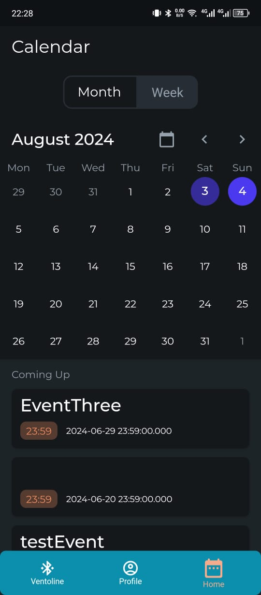

# iVento Application

## Overview

The Ventoline BLE Tracker is a mobile application designed to connect to a Ventoline inhaler equipped with Bluetooth Low Energy (BLE) technology. This app allows users to monitor and track their Ventoline device.

## Features

- **Account Creation and Login/Signup**: Securely create an account or log in to access your personalized inhaler tracking data.
- **BLE Connectivity**: Automatically detect and connect to the Ventoline BLE device.
- **Data Communication**: Send data to and receive data from the BLE device for real-time updates.
- **Profile Editing**: Edit user profiles to keep information up to date.
- **Event Creation**: Create events in the calendar as alarms/reminders for Ventoline usage.

## Screenshots

### Home Screen

*Connect to your Ventoline BLE device.*

### Login / SignUp

*Create a new account or log in to access your personalized data.*

### BLE Connectivity

*Detect and connect to the Ventoline BLE device.*

### Data Communication

*Send data to and receive data from the BLE device.*

### Profile Editing

*Edit your profile to keep your information up to date.*

### Event Creation

*Create events in the calendar as alarms/reminders for Ventoline usage.*

## License

This project is licensed under the MIT License. See the [LICENSE](LICENSE) file for more details.

## Contact

For any questions or support, please contact us at benrejebdhaker3@gmail.com.

---
